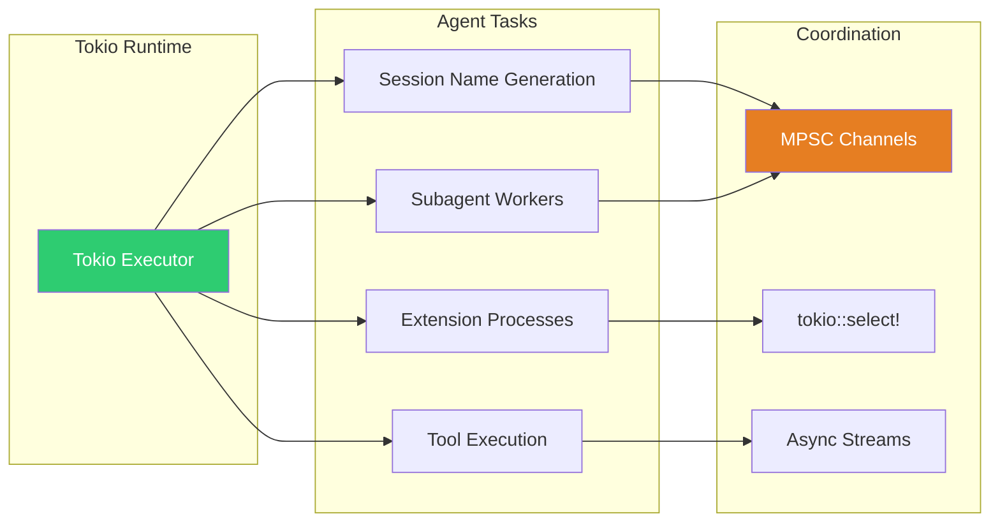
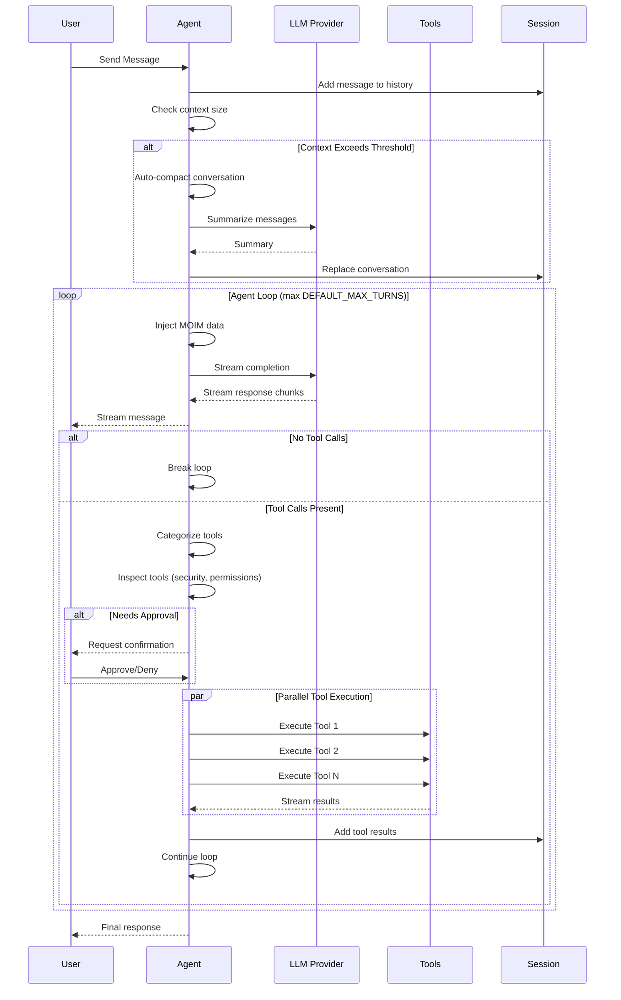
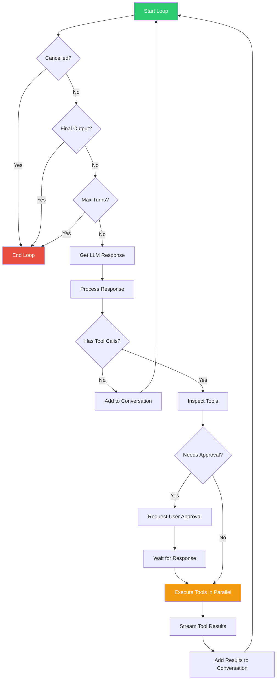
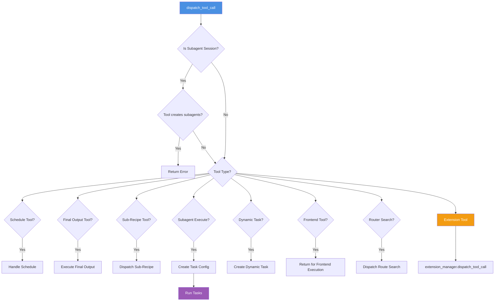
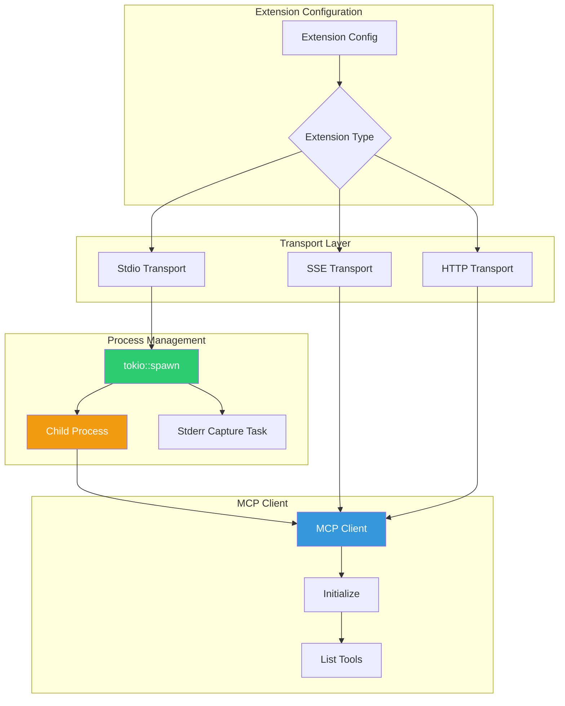
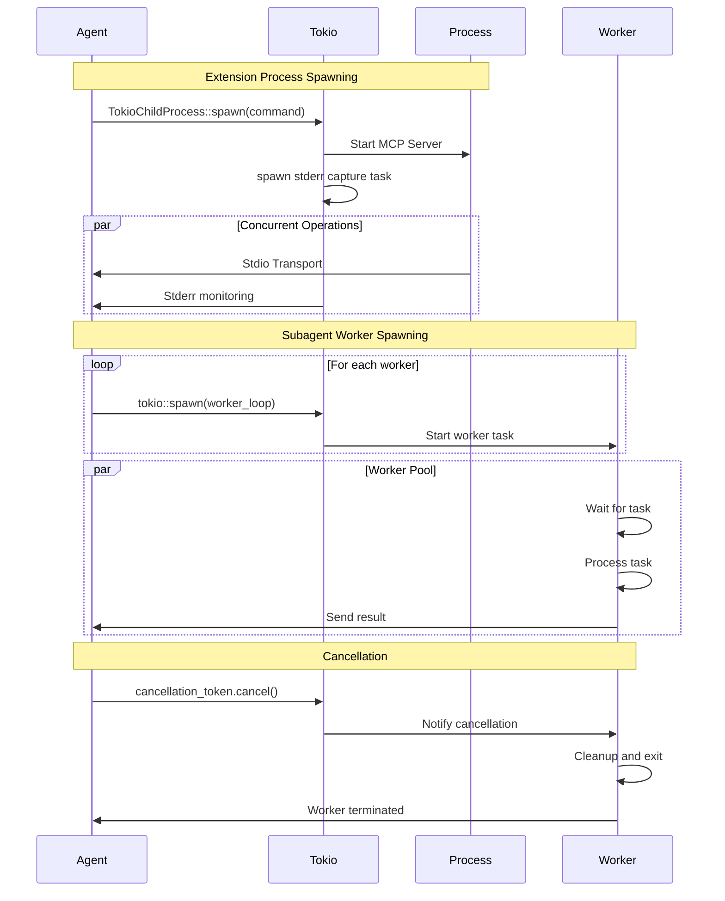
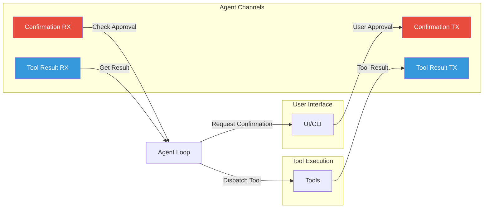

# Agent System Deep Dive: Architecture and Tokio Concurrency

This document provides an in-depth analysis of the goose Agent System, explaining its architecture, components, the agent execution loop, and how Tokio is used for asynchronous operations and process spawning.

## Table of Contents

- [Overview](#overview)
- [Agent Architecture](#agent-architecture)
- [Tokio Concurrency Model](#tokio-concurrency-model)
- [Agent Components](#agent-components)
- [The Agent Loop](#the-agent-loop)
- [Tool Execution System](#tool-execution-system)
- [Extension Management](#extension-management)
- [Subagent System](#subagent-system)
- [Process Spawning with Tokio](#process-spawning-with-tokio)
- [Message Flow](#message-flow)
- [Performance Patterns](#performance-patterns)

## Overview

The Agent System is the core orchestration engine of goose, responsible for:
- Managing conversation flow between user and LLM
- Executing tools and managing extensions
- Handling context and memory
- Coordinating subagents for parallel task execution
- Managing permissions and security
- Providing real-time streaming responses

**Key Statistics:**
- **118+ async operations** across agent files
- **Async/streaming architecture** throughout
- **Multi-level concurrency**: Sessions → Agents → Tools → Workers
- **Tokio-based** runtime for all async operations

## Agent Architecture

### Core Structure

```rust
pub struct Agent {
    // Provider management
    provider: SharedProvider,  // Arc<Mutex<Option<Arc<dyn Provider>>>>

    // Extension and tool management
    extension_manager: Arc<ExtensionManager>,
    sub_recipe_manager: Mutex<SubRecipeManager>,
    tasks_manager: TasksManager,
    tool_route_manager: Arc<ToolRouteManager>,

    // Tool execution
    final_output_tool: Arc<Mutex<Option<FinalOutputTool>>>,
    frontend_tools: Mutex<HashMap<String, FrontendTool>>,

    // Prompt management
    prompt_manager: Mutex<PromptManager>,
    frontend_instructions: Mutex<Option<String>>,

    // Communication channels (mpsc)
    confirmation_tx: mpsc::Sender<(String, PermissionConfirmation)>,
    confirmation_rx: Mutex<mpsc::Receiver<(String, PermissionConfirmation)>>,
    tool_result_tx: mpsc::Sender<(String, ToolResult<Vec<Content>>)>,
    tool_result_rx: ToolResultReceiver,  // Arc<Mutex<mpsc::Receiver>>

    // Support services
    scheduler_service: Mutex<Option<Arc<dyn SchedulerTrait>>>,
    retry_manager: RetryManager,
    tool_inspection_manager: ToolInspectionManager,
}
```

### Component Diagram

```mermaid
graph TB
    subgraph "Agent Core"
        Agent[Agent Struct]
        Provider[Shared Provider]
        PromptMgr[Prompt Manager]
    end

    subgraph "Communication Channels"
        ConfirmTx[confirmation_tx]
        ConfirmRx[confirmation_rx]
        ToolTx[tool_result_tx]
        ToolRx[tool_result_rx]
    end

    subgraph "Tool Management"
        ExtMgr[Extension Manager]
        ToolRoute[Tool Route Manager]
        SubRecipe[Sub Recipe Manager]
        TasksMgr[Tasks Manager]
    end

    subgraph "Execution Support"
        RetryMgr[Retry Manager]
        ToolInsp[Tool Inspection Manager]
        Scheduler[Scheduler Service]
    end

    Agent --> Provider
    Agent --> PromptMgr
    Agent --> ConfirmTx
    Agent --> ConfirmRx
    Agent --> ToolTx
    Agent --> ToolRx
    Agent --> ExtMgr
    Agent --> ToolRoute
    Agent --> SubRecipe
    Agent --> TasksMgr
    Agent --> RetryMgr
    Agent --> ToolInsp
    Agent --> Scheduler

    style Agent fill:#4A90E2,color:#fff
    style ConfirmTx fill:#E74C3C,color:#fff
    style ConfirmRx fill:#E74C3C,color:#fff
    style ToolTx fill:#E74C3C,color:#fff
    style ToolRx fill:#E74C3C,color:#fff
```



## Tokio Concurrency Model

### Why Tokio?

goose uses Tokio extensively for:
1. **Async I/O**: Non-blocking operations for LLM streaming, file I/O, network requests
2. **Process Management**: Spawning and managing child processes (MCP servers)
3. **Concurrent Execution**: Parallel tool execution and subagent coordination
4. **Message Passing**: Channel-based communication between components
5. **Cancellation**: Graceful cancellation via `CancellationToken`

### Concurrency Primitives

```rust
// 1. Async Tasks - tokio::spawn
tokio::spawn(async move {
    // Background work
});

// 2. Message Passing - mpsc channels
let (tx, rx) = mpsc::channel::<Message>(32);

// 3. Shared State - Arc<Mutex<T>>
let shared: Arc<Mutex<State>> = Arc::new(Mutex::new(state));

// 4. Cancellation - CancellationToken
let token = CancellationToken::new();
tokio::select! {
    result = do_work() => { /* work completed */ }
    _ = token.cancelled() => { /* cancelled */ }
}

// 5. Streams - async streams
let stream: BoxStream<Result<Event>> = Box::pin(async_stream::try_stream! {
    yield event;
});
```

### Tokio Usage in Agent System



## Agent Components

### 1. Extension Manager

Manages MCP (Model Context Protocol) servers and external tools.

**Key Responsibilities:**
- Load and initialize MCP servers
- Manage extension lifecycle
- Dispatch tool calls to appropriate extensions
- Handle extension state and configurations

**File:** `agents/extension_manager.rs:246-end`

```rust
pub struct ExtensionManager {
    extensions: Mutex<HashMap<String, Extension>>,
    context: Mutex<PlatformExtensionContext>,
    provider: SharedProvider,
}
```

**Extension Types:**
- **Stdio Process**: MCP servers running as child processes
- **SSE (Server-Sent Events)**: HTTP-based streaming MCP servers
- **StreamableHttp**: HTTP endpoints with optional OAuth
- **Frontend**: Tools executed by frontend (Desktop/CLI)
- **Platform**: Built-in platform tools

### 2. Tool Route Manager

Manages intelligent tool routing and selection.

**Key Features:**
- LLM-based tool search and selection
- Tool indexing for semantic search
- Route analytics and optimization
- Dynamic tool discovery

**File:** `agents/tool_route_manager.rs`

### 3. Prompt Manager

Dynamically builds system prompts from multiple sources.

**Prompt Sources:**
1. Base system prompt
2. Recipe instructions
3. Extension instructions
4. Frontend instructions
5. Tool definitions
6. Goose mode instructions
7. Session context

**File:** `agents/prompt_manager.rs`

### 4. Tool Inspection Manager

Provides layered security and permission checking.

**Inspection Layers:**
1. **Security Inspector** (Highest priority)
   - Prompt injection detection
   - Malware scanning
   - Pattern analysis

2. **Permission Inspector** (Medium-high priority)
   - Tool permission validation
   - Read-only tool detection
   - User confirmation workflows

3. **Repetition Inspector** (Lower priority)
   - Detects tool call loops
   - Prevents infinite repetition

**File:** `agents/agent.rs:186-204`

## The Agent Loop

### Main Reply Function

Location: `agents/agent.rs:781-897`

```rust
pub async fn reply(
    &self,
    user_message: Message,
    session_config: SessionConfig,
    cancel_token: Option<CancellationToken>,
) -> Result<BoxStream<'_, Result<AgentEvent>>>
```

### Agent Loop Flow



### Inner Loop Implementation

Location: `agents/agent.rs:899-end`

```rust
async fn reply_internal(
    &self,
    conversation: Conversation,
    session_config: SessionConfig,
    session: Session,
    cancel_token: Option<CancellationToken>,
) -> Result<BoxStream<'_, Result<AgentEvent>>> {
    // Prepare context
    let context = self.prepare_reply_context(conversation, &session.working_dir).await?;

    // Main loop
    Ok(Box::pin(async_stream::try_stream! {
        let mut turns_taken = 0u32;
        let max_turns = session_config.max_turns.unwrap_or(DEFAULT_MAX_TURNS);

        loop {
            // Check cancellation
            if is_token_cancelled(&cancel_token) {
                break;
            }

            // Check final output
            if final_output_complete {
                yield final_event;
                break;
            }

            // Increment turn counter
            turns_taken += 1;
            if turns_taken > max_turns {
                yield max_turns_reached_message;
                break;
            }

            // Get provider response
            let mut stream = Self::stream_response_from_provider(...).await?;

            while let Some(next) = stream.next().await {
                match next {
                    Ok((response, usage)) => {
                        // Process response
                        // Execute tools if present
                        // Stream results to user
                    }
                    Err(ProviderError::ContextLengthExceeded(_)) => {
                        // Perform recovery compaction
                    }
                    Err(e) => {
                        // Handle error
                    }
                }
            }
        }
    }))
}
```

### Loop Control Flow



## Tool Execution System

### Tool Dispatch

Location: `agents/agent.rs:414-621`

```rust
pub async fn dispatch_tool_call(
    &self,
    tool_call: CallToolRequestParam,
    request_id: String,
    cancellation_token: Option<CancellationToken>,
    session: &Session,
) -> (String, Result<ToolCallResult, ErrorData>)
```

### Tool Routing Logic



### Parallel Tool Execution

Location: `agents/agent.rs:1122-1152`

Tools execute concurrently using `stream::select_all`:

```rust
// Create streams for each tool execution
let with_id = tool_futures
    .into_iter()
    .map(|(request_id, stream)| {
        stream.map(move |item| (request_id.clone(), item))
    })
    .collect::<Vec<_>>();

// Combine all streams for concurrent execution
let mut combined = stream::select_all(with_id);

// Process results as they arrive
while let Some((request_id, item)) = combined.next().await {
    match item {
        ToolStreamItem::Result(output) => {
            // Handle tool result
        }
        ToolStreamItem::Message(msg) => {
            // Handle MCP notification
            yield AgentEvent::McpNotification((request_id, msg));
        }
    }
}
```

## Extension Management

### Extension Initialization

Location: `agents/extension_manager.rs:280-end`

**Process:**
1. Parse extension configuration
2. Set up environment variables
3. Create appropriate transport
4. Spawn process (if stdio)
5. Initialize MCP client
6. Store in extensions map

### Stdio Process Extension

```rust
async fn child_process_client(
    mut command: Command,
    timeout: &Option<u64>,
    provider: SharedProvider,
) -> ExtensionResult<McpClient> {
    // Configure process
    #[cfg(unix)]
    command.process_group(0);
    configure_command_no_window(&mut command);

    // Set PATH
    if let Ok(path) = SearchPaths::builder().path() {
        command.env("PATH", path);
    }

    // Spawn process with stderr capture
    let (transport, mut stderr) = TokioChildProcess::builder(command)
        .stderr(Stdio::piped())
        .spawn()?;

    let mut stderr = stderr.take().ok_or_else(|| {
        ExtensionError::SetupError("failed to attach child process stderr".to_owned())
    })?;

    // Spawn task to capture stderr
    let stderr_task = tokio::spawn(async move {
        let mut all_stderr = Vec::new();
        stderr.read_to_end(&mut all_stderr).await?;
        Ok::<String, std::io::Error>(String::from_utf8_lossy(&all_stderr).into())
    });

    // Connect MCP client
    let client_result = McpClient::connect(
        transport,
        Duration::from_secs(timeout.unwrap_or(DEFAULT_EXTENSION_TIMEOUT)),
        provider,
    )
    .await;

    // Handle connection errors with stderr
    match client_result {
        Ok(client) => Ok(client),
        Err(error) => {
            let error_task_out = stderr_task.await?;
            Err(match error_task_out {
                Ok(stderr_content) => ProcessExit::new(stderr_content, error).into(),
                Err(e) => e.into(),
            })
        }
    }
}
```

### Extension Diagram



## Subagent System

### Overview

Subagents enable parallel task execution with full agent capabilities.

**Key Features:**
- Independent agent instances
- Parallel or sequential execution
- Task tracking and monitoring
- Cancellation support
- Resource isolation

### Subagent Execution

Location: `agents/subagent_execution_tool/executor/mod.rs`

### Single Task Execution

```rust
pub async fn execute_single_task(
    task: &Task,
    notifier: mpsc::Sender<ServerNotification>,
    task_config: TaskConfig,
    cancellation_token: Option<CancellationToken>,
) -> ExecutionResponse {
    let start_time = Instant::now();

    // Create tracker
    let task_execution_tracker = Arc::new(TaskExecutionTracker::new(
        vec![task.clone()],
        DisplayMode::SingleTaskOutput,
        notifier,
        cancellation_token.clone(),
    ));

    // Process task with cancellation support
    let result = process_task(
        task,
        task_execution_tracker.clone(),
        task_config,
        cancellation_token.unwrap_or_default(),
    )
    .await;

    // Complete task
    task_execution_tracker
        .complete_task(&result.task_id, result.clone())
        .await;

    let execution_time = start_time.elapsed().as_millis();
    let stats = calculate_stats(std::slice::from_ref(&result), execution_time);

    ExecutionResponse {
        status: "completed".to_string(),
        results: vec![result],
        stats,
    }
}
```

### Parallel Task Execution

```rust
pub async fn execute_tasks_in_parallel(
    tasks: Vec<Task>,
    notifier: Sender<ServerNotification>,
    task_config: TaskConfig,
    cancellation_token: Option<CancellationToken>,
) -> ExecutionResponse {
    let task_count = tasks.len();

    // Create channels
    let (task_tx, task_rx) = mpsc::channel::<Task>(task_count);
    let (result_tx, mut result_rx) = mpsc::channel::<TaskResult>(task_count);

    // Send tasks to channel
    for task in tasks {
        task_tx.send(task).await.expect("Failed to queue task");
    }

    // Create shared state
    let shared_state = Arc::new(SharedState {
        task_receiver: Arc::new(Mutex::new(task_rx)),
        result_sender: result_tx,
        active_workers: Arc::new(AtomicUsize::new(0)),
        task_execution_tracker,
        cancellation_token: cancellation_token.unwrap_or_default(),
    });

    // Spawn worker tasks
    let worker_count = std::cmp::min(task_count, DEFAULT_MAX_WORKERS);
    let mut worker_handles = Vec::new();

    for i in 0..worker_count {
        let handle = spawn_worker(shared_state.clone(), i, task_config.clone());
        worker_handles.push(handle);
    }

    // Collect results
    let results = collect_results(&mut result_rx, task_count).await;

    // Wait for workers
    for handle in worker_handles {
        if let Err(e) = handle.await {
            tracing::error!("Worker error: {}", e);
        }
    }

    ExecutionResponse {
        status: "completed".to_string(),
        results,
        stats: calculate_stats(&results, execution_time_ms),
    }
}
```

## Process Spawning with Tokio

### Tokio Spawn Locations

**1. Session Name Generation**
```rust
// agents/agent.rs:923-927
let session_id = session_config.id.clone();
let working_dir = session.working_dir.clone();
tokio::spawn(async move {
    if let Err(e) = SessionManager::maybe_update_name(&session_id, provider).await {
        warn!("Failed to generate session description: {}", e);
    }
});
```

**Purpose:** Background task to generate/update session name without blocking agent loop

**2. Extension Stderr Capture**
```rust
// agents/extension_manager.rs:199-203
let stderr_task = tokio::spawn(async move {
    let mut all_stderr = Vec::new();
    stderr.read_to_end(&mut all_stderr).await?;
    Ok::<String, std::io::Error>(String::from_utf8_lossy(&all_stderr).into())
});
```

**Purpose:** Capture stderr from MCP server processes for error reporting

**3. Subagent Workers**
```rust
// agents/subagent_execution_tool/workers.rs:11-21
pub fn spawn_worker(
    state: Arc<SharedState>,
    worker_id: usize,
    task_config: TaskConfig,
) -> tokio::task::JoinHandle<()> {
    state.increment_active_workers();

    tokio::spawn(async move {
        worker_loop(state, worker_id, task_config).await;
    })
}
```

**Purpose:** Create worker tasks for parallel subagent execution

### Worker Loop Implementation

Location: `agents/subagent_execution_tool/workers.rs:23-57`

```rust
async fn worker_loop(
    state: Arc<SharedState>,
    _worker_id: usize,
    task_config: TaskConfig
) {
    loop {
        tokio::select! {
            // Receive task from queue
            task_option = receive_task(&state) => {
                match task_option {
                    Some(task) => {
                        // Mark task as started
                        state.task_execution_tracker.start_task(&task.id).await;

                        // Process task
                        let result = process_task(
                            &task,
                            state.task_execution_tracker.clone(),
                            task_config.clone(),
                            state.cancellation_token.clone(),
                        )
                        .await;

                        // Send result
                        if let Err(e) = state.result_sender.send(result).await {
                            if !state.cancellation_token.is_cancelled() {
                                tracing::error!("Worker failed to send result: {}", e);
                            }
                            break;
                        }
                    }
                    None => break, // No more tasks
                }
            }
            // Handle cancellation
            _ = state.cancellation_token.cancelled() => {
                tracing::debug!("Worker cancelled");
                break;
            }
        }
    }

    state.decrement_active_workers();
}
```

### Task Processing with Cancellation

Location: `agents/subagent_execution_tool/tasks.rs:31-94`

```rust
async fn handle_recipe_task(
    task: Task,
    mut task_config: TaskConfig,
    cancellation_token: CancellationToken,
) -> Result<Value, String> {
    // ... configure task ...

    // Execute with cancellation support
    tokio::select! {
        result = run_complete_subagent_task(
            recipe,
            task_config,
            return_last_only,
            task.id.clone()
        ) => {
            result.map(|text| serde_json::json!({"result": text}))
                  .map_err(|e| format!("Recipe execution failed: {}", e))
        }
        _ = cancellation_token.cancelled() => {
            Err("Task cancelled".to_string())
        }
    }
}
```

### Process Spawning Diagram



## Message Flow

### Channel-Based Communication



### Confirmation Workflow

```rust
// Request confirmation
let confirmation = Message::assistant()
    .with_tool_confirmation_request(
        request.id.clone(),
        tool_call.name.clone(),
        tool_call.arguments.clone(),
        security_message,
    )
    .user_only();
yield confirmation;

// Wait for user response
let mut rx = self.confirmation_rx.lock().await;
while let Some((req_id, confirmation)) = rx.recv().await {
    if req_id == request.id {
        if confirmation.permission == Permission::AllowOnce
            || confirmation.permission == Permission::AlwaysAllow
        {
            // Execute tool
        } else {
            // Deny tool
        }
        break;
    }
}
```

## Performance Patterns

### 1. Concurrent Tool Execution

```rust
// Execute multiple tools concurrently
let mut tool_futures: Vec<(String, ToolStream)> = Vec::new();

for request in approved_requests {
    let (req_id, tool_result) = self.dispatch_tool_call(...).await;
    tool_futures.push((req_id, tool_stream));
}

// Combine all streams
let mut combined = stream::select_all(tool_futures);

// Process results as they arrive
while let Some((request_id, item)) = combined.next().await {
    // Handle result
}
```

### 2. Async Streaming

```rust
// Stream responses to user in real-time
Ok(Box::pin(async_stream::try_stream! {
    loop {
        let response = get_next_response().await?;
        yield AgentEvent::Message(response);
    }
}))
```

### 3. Cancellation Support

```rust
tokio::select! {
    result = long_running_task() => {
        // Task completed
    }
    _ = cancellation_token.cancelled() => {
        // Task cancelled
        return Err("Cancelled");
    }
}
```

### 4. Worker Pool Pattern

```rust
// Create bounded channels
let (task_tx, task_rx) = mpsc::channel(task_count);
let (result_tx, result_rx) = mpsc::channel(task_count);

// Spawn fixed number of workers
for i in 0..worker_count {
    tokio::spawn(worker_loop(task_rx.clone(), result_tx.clone()));
}

// Send tasks to workers
for task in tasks {
    task_tx.send(task).await?;
}

// Collect results
while let Some(result) = result_rx.recv().await {
    results.push(result);
}
```

### 5. Shared State with Arc<Mutex<T>>

```rust
// Create shared provider
let provider: Arc<Mutex<Option<Arc<dyn Provider>>>> = Arc::new(Mutex::new(None));

// Clone for sharing across tasks
let provider_clone = provider.clone();
tokio::spawn(async move {
    let p = provider_clone.lock().await;
    // Use provider
});
```

## Key Takeaways

### Architecture Principles

1. **Async-First Design**: All I/O operations are async, enabling high concurrency
2. **Channel-Based Communication**: Message passing via mpsc for loose coupling
3. **Graceful Cancellation**: CancellationToken for clean shutdown
4. **Resource Isolation**: Each session/subagent has independent resources
5. **Stream-Based Responses**: Real-time user feedback via async streams

### Tokio Usage Patterns

1. **`tokio::spawn`**: Background tasks that don't block main flow
2. **`tokio::select!`**: Concurrent operations with cancellation
3. **`mpsc::channel`**: Producer-consumer communication
4. **`Arc<Mutex<T>>`**: Shared mutable state across tasks
5. **`BoxStream`**: Async iterators for streaming data

### Concurrency Benefits

- **Non-blocking**: LLM streaming doesn't block tool execution
- **Parallelism**: Multiple tools execute concurrently
- **Scalability**: Worker pool pattern scales to available cores
- **Responsiveness**: Immediate cancellation via tokens
- **Efficiency**: No thread-per-operation overhead

## Related Files

**Core Agent:**
- `agents/agent.rs` - Main agent implementation (1500+ lines)
- `agents/types.rs` - Type definitions
- `agents/reply_parts.rs` - Response processing

**Tool System:**
- `agents/tool_execution.rs` - Tool execution logic
- `agents/tool_route_manager.rs` - Tool routing
- `agents/tool_router_index_manager.rs` - Tool indexing

**Extension System:**
- `agents/extension_manager.rs` - Extension lifecycle
- `agents/extension.rs` - Extension types
- `agents/mcp_client.rs` - MCP client implementation

**Subagent System:**
- `agents/subagent_handler.rs` - Subagent coordination
- `agents/subagent_execution_tool/executor/mod.rs` - Task execution
- `agents/subagent_execution_tool/workers.rs` - Worker pool
- `agents/subagent_execution_tool/tasks.rs` - Task processing

**Supporting:**
- `subprocess.rs` - Process configuration
- `context_mgmt/` - Context and memory management
- `permission/` - Permission system
- `security/` - Security inspection

## Further Reading

- [ARCHITECTURE.md](./ARCHITECTURE.md) - Overall system architecture
- [CLAUDE.md](./CLAUDE.md) - Claude integration guide
- [Tokio Documentation](https://tokio.rs/) - Async runtime
- [MCP Protocol](https://modelcontextprotocol.io) - Extension protocol
