# goose Crate Architecture

This document provides a comprehensive overview of the `goose` crate architecture, detailing its core components, data flows, and interactions.

## Table of Contents

- [Overview](#overview)
- [High-Level Architecture](#high-level-architecture)
- [Core Components](#core-components)
- [Data Flow](#data-flow)
- [Module Dependencies](#module-dependencies)
- [Component Details](#component-details)

## Overview

The `goose` crate is the core library powering the goose AI agent. It implements a sophisticated agent system that orchestrates LLM interactions, tool execution, session management, and extensibility through MCP (Model Context Protocol) servers.

**Key Statistics:**
- **163 Rust source files**
- **27 main modules**
- **Multiple provider integrations** (Anthropic, OpenAI, Google, AWS, Azure, etc.)
- **Extensible architecture** via MCP protocol

## High-Level Architecture

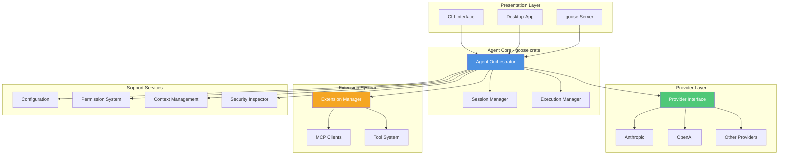

## Core Components

### 1. Agent System (`agents/`)

The Agent module is the heart of goose, orchestrating all agent operations.

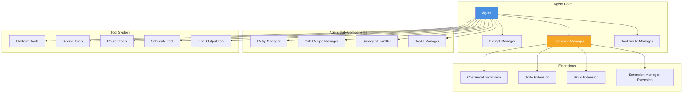

**Key Responsibilities:**
- **Agent (`agent.rs`)**: Main orchestrator for agent loop, message processing, and tool execution
- **Prompt Manager**: Builds and manages system prompts with dynamic components
- **Extension Manager**: Manages MCP clients and external tool integrations
- **Retry Manager**: Handles retry logic for failed operations
- **Subagent Handler**: Manages subagent spawning and coordination
- **Tool Execution**: Dispatches and monitors tool calls

### 2. Provider System (`providers/`)

Abstraction layer for LLM providers with support for 20+ providers.

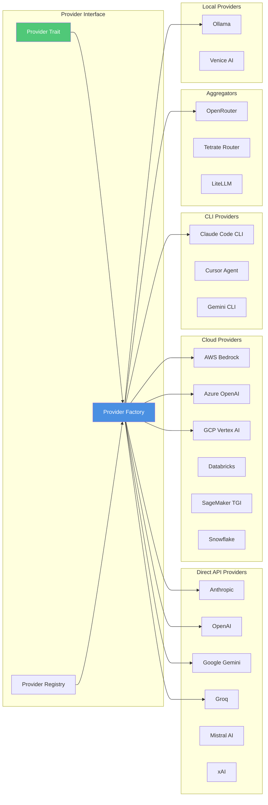

**Key Features:**
- **Unified Interface**: `Provider` trait abstracts all LLM interactions
- **Streaming Support**: Real-time response streaming
- **Multi-Model**: Lead/worker model pattern for efficiency
- **Format Adapters**: Convert between provider-specific formats
- **Retry Logic**: Automatic retry with exponential backoff
- **Rate Limiting**: Built-in rate limit handling

### 3. Conversation Management (`conversation/`)

Manages message history and conversation state.

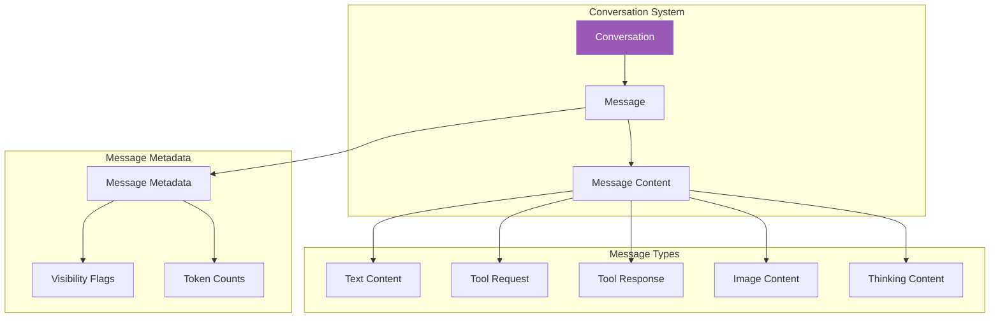

**Key Responsibilities:**
- Message validation and ordering
- Role management (User, Assistant, System)
- Tool call/response tracking
- Message merging and deduplication
- Serialization/deserialization

### 4. Session Management (`session/`)

Handles session lifecycle, persistence, and state.

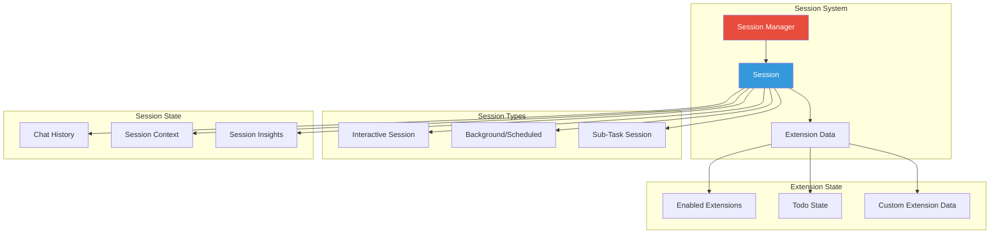

**Key Features:**
- Session creation and lifecycle management
- Conversation persistence and loading
- Extension state management
- Session diagnostics and insights
- Multi-session coordination

### 5. Extension System (`agents/extension*.rs`, `agents/mcp_client.rs`)

Provides extensibility through MCP (Model Context Protocol).

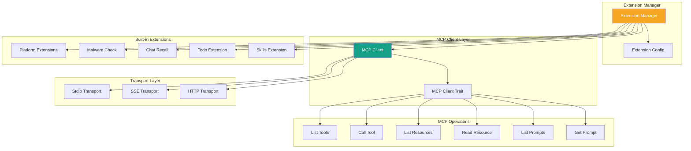

**Key Features:**
- Dynamic extension loading and management
- MCP protocol implementation
- Tool registration and routing
- Resource management
- OAuth flow support for authenticated extensions
- Notification handling and streaming

### 6. Recipe System (`recipe/`)

Workflow and task automation through recipes.

```mermaid
graph TB
    subgraph "Recipe System"
        Recipe[Recipe]
        Builder[Recipe Builder]
        Template[Template Recipe]
    end

    subgraph "Recipe Components"
        Instructions[Instructions]
        Prompt[Initial Prompt]
        Settings[Settings]
        Params[Parameters]
    end

    subgraph "Recipe Features"
        SubRecipes[Sub-Recipes]
        Extensions[Recipe Extensions]
        Response[Response Schema]
        Retry[Retry Config]
    end

    subgraph "Recipe Tools"
        Dynamic[Dynamic Task Tools]
        SubRecipeTool[Sub-Recipe Tools]
    end

    Recipe --> Builder
    Recipe --> Template

    Recipe --> Instructions
    Recipe --> Prompt
    Recipe --> Settings
    Recipe --> Params

    Recipe --> SubRecipes
    Recipe --> Extensions
    Recipe --> Response
    Recipe --> Retry

    Recipe --> Dynamic
    Recipe --> SubRecipeTool

    style Recipe fill:#8E44AD,color:#fff
```

**Key Features:**
- YAML/JSON recipe definitions
- Parameter templating
- Sub-recipe composition
- Extension activation
- Response schema validation
- Local and built-in recipe management

### 7. Configuration System (`config/`)

Global configuration and settings management.

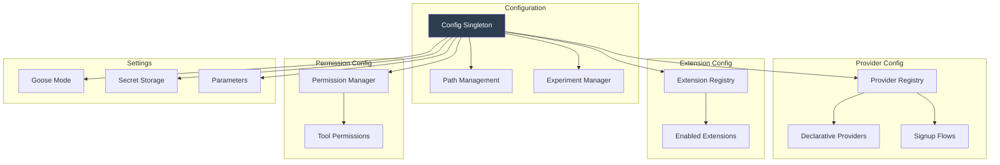

**Key Responsibilities:**
- Global singleton configuration
- Provider registration and credentials
- Extension management
- Permission settings
- Path resolution (config, data, state)
- Feature flag management

### 8. Context Management (`context_mgmt/`)

Manages conversation context and token limits.

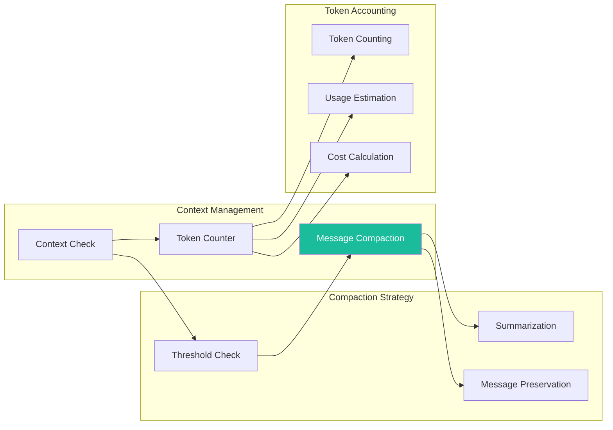

**Key Features:**
- Automatic context compaction at 80% threshold
- Smart message summarization using LLM
- Token counting for multiple providers
- Cost estimation
- Manual compaction support

### 9. Permission System (`permission/`)

Security and permission management for tool execution.

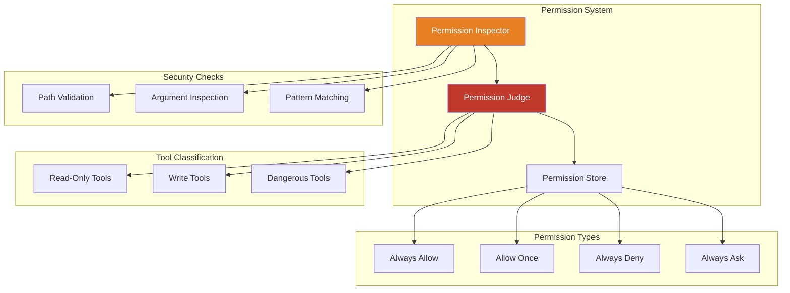

**Key Features:**
- Tool-level permission control
- Argument validation
- Automatic read-only tool detection
- User confirmation workflows
- Permission persistence

### 10. Security System (`security/`)

Advanced security inspection and threat detection.

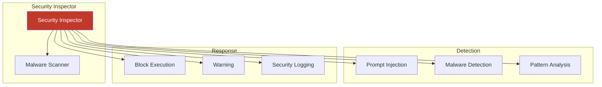

### 11. Execution System (`execution/`)

Session execution lifecycle management.

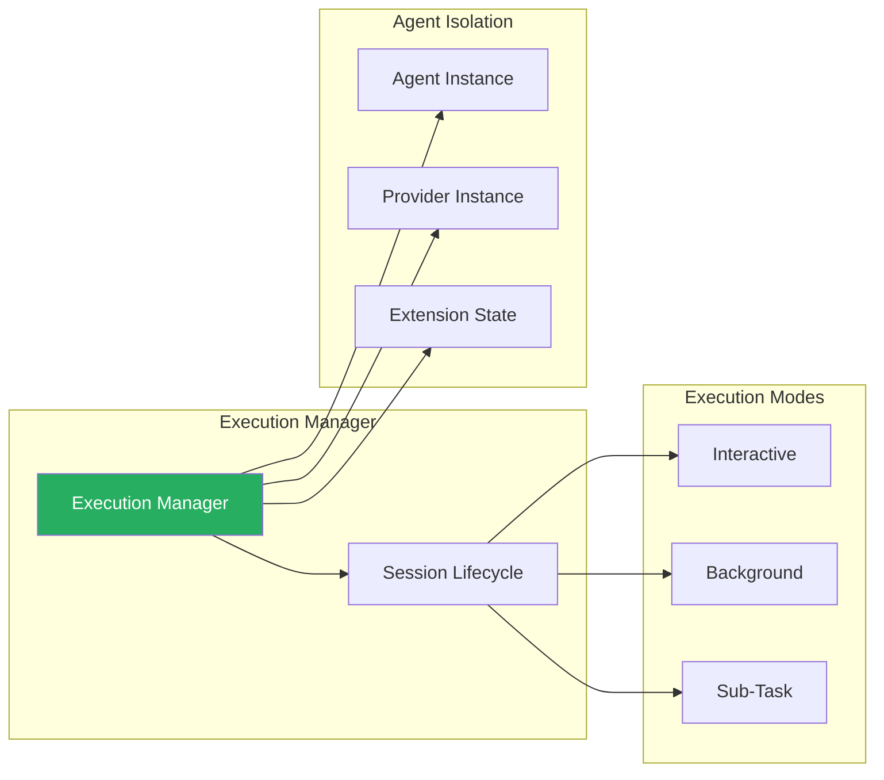

## Data Flow

### Agent Reply Loop

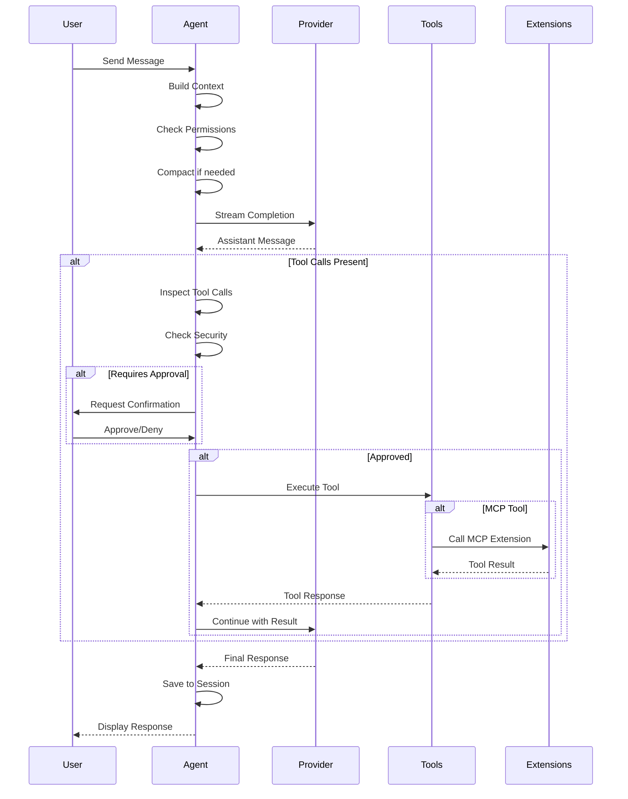

### Extension Tool Execution

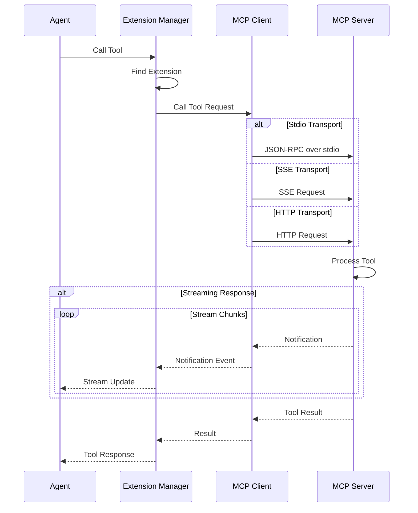

### Context Compaction Flow

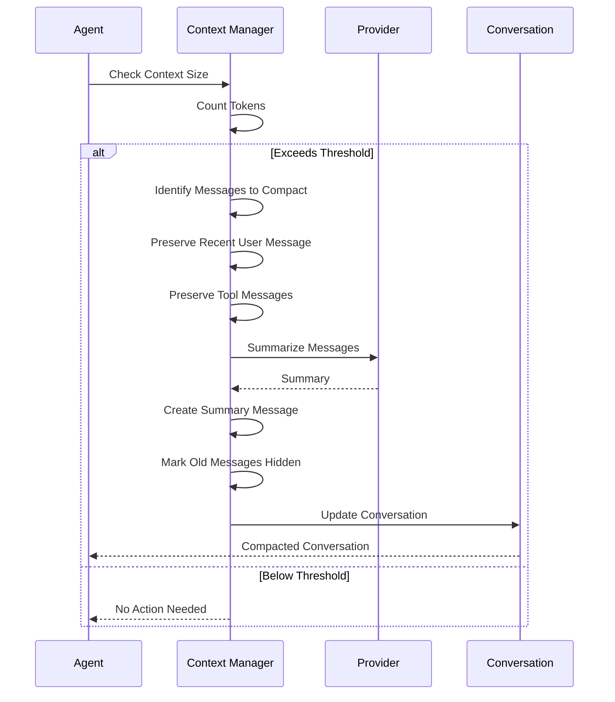

## Module Dependencies

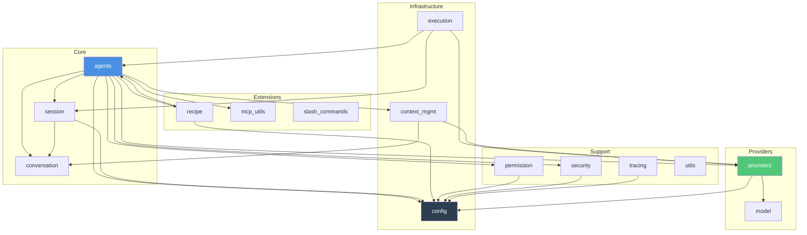

## Component Details

### Tool Routing and Execution

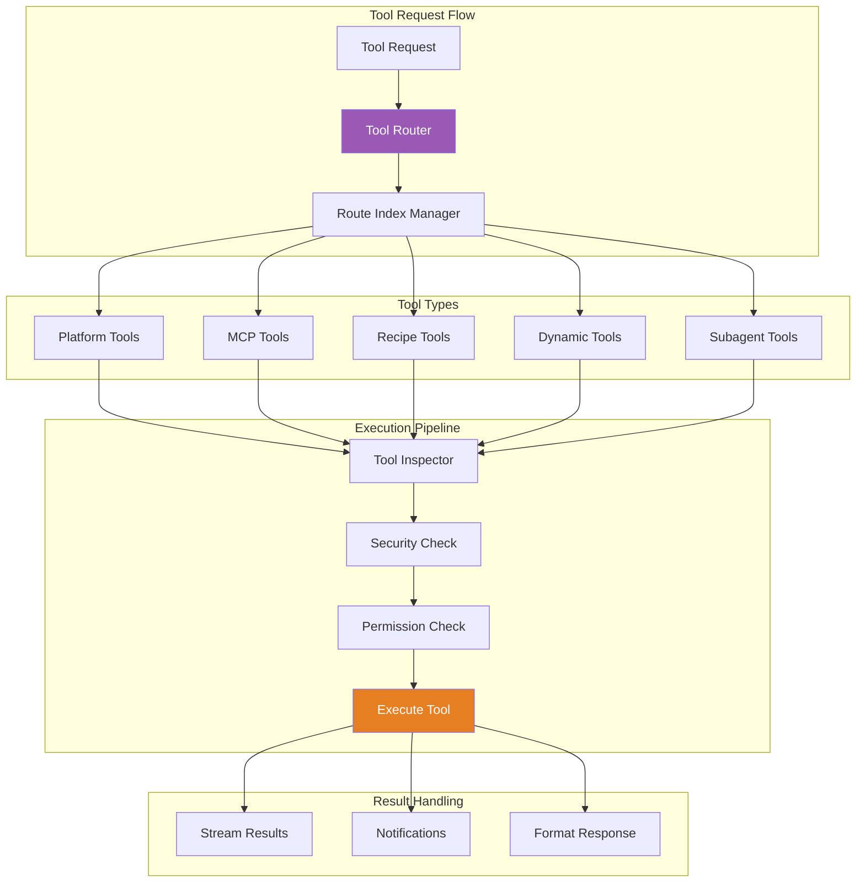

### Subagent System

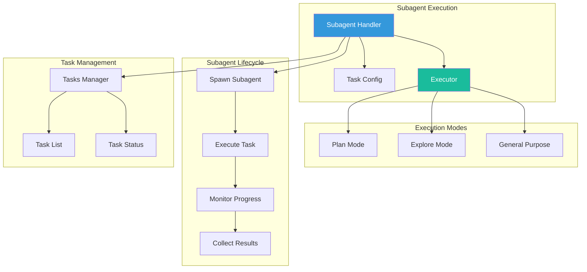

### Prompt Management

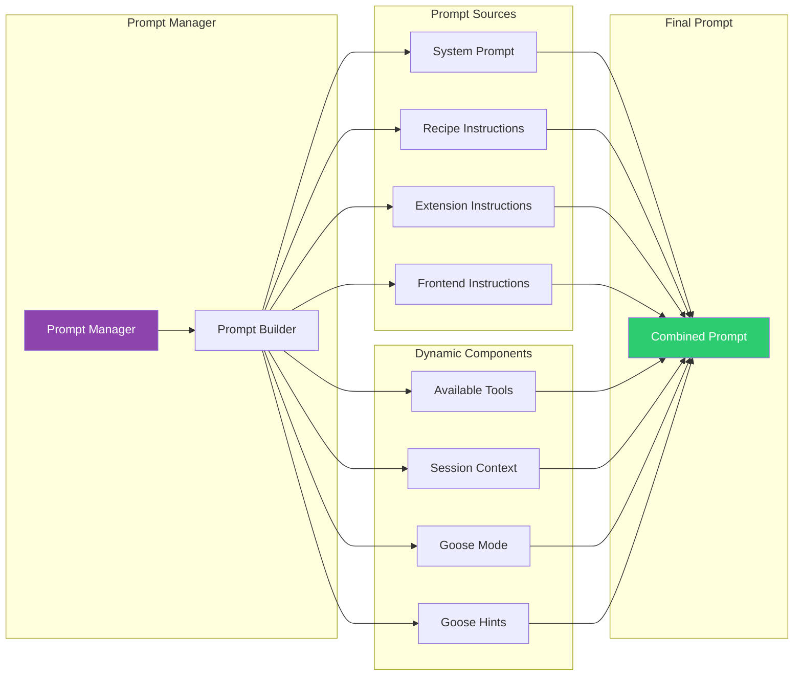

### Multi-Model (Lead-Worker) Pattern

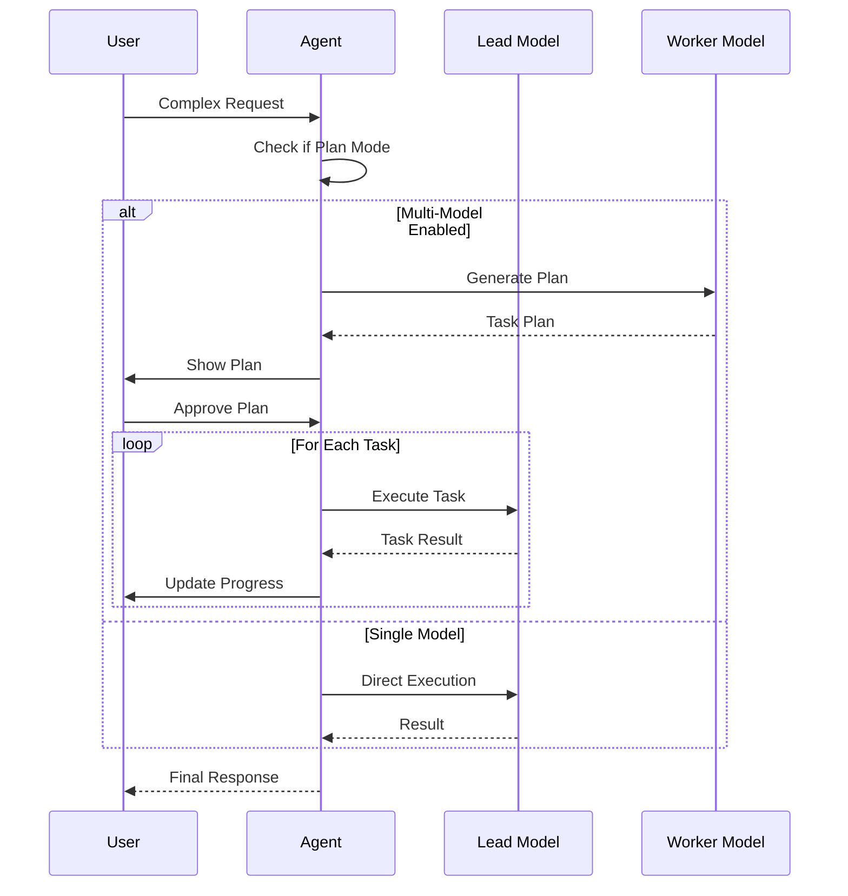

## Key Design Patterns

### 1. **Provider Abstraction**
- Trait-based abstraction for all LLM providers
- Unified streaming interface
- Format adapters for provider-specific protocols

### 2. **Extension via MCP**
- Protocol-based extension system
- Dynamic loading and hot-reload
- Isolated execution environments

### 3. **Event-Driven Architecture**
- Async/await throughout
- Stream-based communication
- Notification system for real-time updates

### 4. **Layered Security**
- Permission system for tool execution
- Security inspector for threat detection
- Malware scanning for extensions

### 5. **State Management**
- Session-based isolation
- Persistent conversation history
- Extension state management

### 6. **Modular Tool System**
- Dynamic tool registration
- Tool routing and indexing
- Built-in and extension tools

## Technology Stack

- **Language**: Rust
- **Async Runtime**: Tokio
- **Serialization**: serde, serde_json
- **HTTP Client**: reqwest
- **Streaming**: futures, async-stream
- **Protocol**: MCP (Model Context Protocol)
- **Error Handling**: anyhow, thiserror
- **Logging**: tracing, tracing-subscriber
- **Testing**: Standard Rust testing + scenario tests

## File Organization

```
crates/goose/src/
├── agents/              # Agent orchestration and tools
│   ├── agent.rs        # Main agent implementation
│   ├── extension_manager.rs
│   ├── mcp_client.rs
│   ├── prompt_manager.rs
│   ├── recipe_tools/   # Recipe-related tools
│   ├── subagent_execution_tool/
│   └── ...
├── providers/          # LLM provider integrations
│   ├── base.rs        # Provider trait
│   ├── factory.rs     # Provider factory
│   ├── anthropic.rs
│   ├── openai.rs
│   ├── formats/       # Format adapters
│   └── ...
├── conversation/       # Message and conversation management
│   ├── mod.rs
│   └── message.rs
├── session/           # Session management
│   ├── session_manager.rs
│   └── extension_data.rs
├── recipe/            # Recipe system
│   ├── mod.rs
│   └── build_recipe/
├── config/            # Configuration system
│   ├── base.rs
│   └── ...
├── context_mgmt/      # Context and token management
├── permission/        # Permission system
├── security/          # Security inspection
├── execution/         # Execution management
├── mcp_utils.rs      # MCP utilities
├── model.rs          # Model configuration
└── lib.rs            # Library entry point
```

## Related Documentation

- [CLAUDE.md](./CLAUDE.md) - Claude integration guide
- [CONTRIBUTING.md](./CONTRIBUTING.md) - Contributing guidelines
- [AGENTS.md](./AGENTS.md) - Agent concepts
- [Provider Documentation](https://block.github.io/goose/docs/getting-started/providers)
- [Recipe Documentation](https://block.github.io/goose/docs/guides/recipes/session-recipes)
- [MCP Documentation](https://modelcontextprotocol.io)

## Architecture Principles

1. **Modularity**: Clear separation of concerns with well-defined module boundaries
2. **Extensibility**: Plugin architecture via MCP for external integrations
3. **Security**: Defense in depth with multiple security layers
4. **Performance**: Async-first design with streaming support
5. **Reliability**: Robust error handling and retry mechanisms
6. **Observability**: Comprehensive tracing and diagnostics
7. **Flexibility**: Support for multiple providers, models, and configurations

## Future Considerations

- **Agent Coordination**: Enhanced multi-agent collaboration
- **Distributed Execution**: Cross-machine subagent execution
- **Advanced Planning**: Improved planning and reasoning capabilities
- **Memory System**: Long-term memory and knowledge management
- **Tool Marketplace**: Community tool sharing and discovery
- **Performance Optimization**: Caching, batching, and optimization strategies
